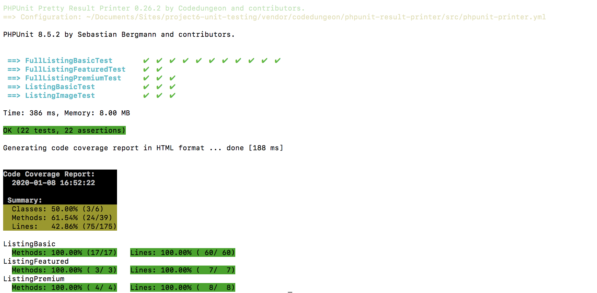
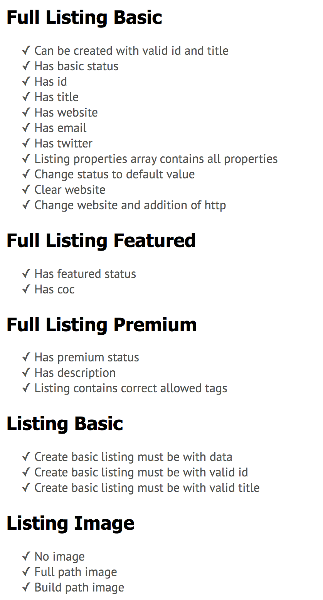
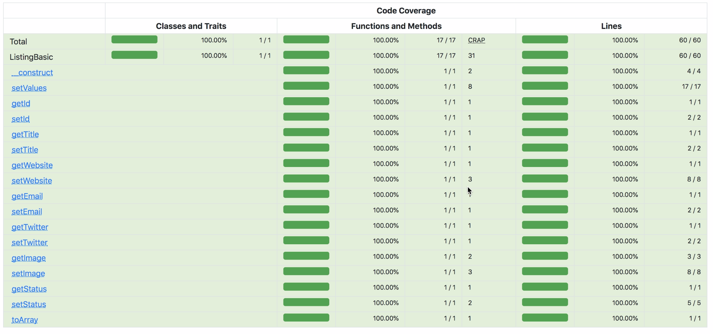
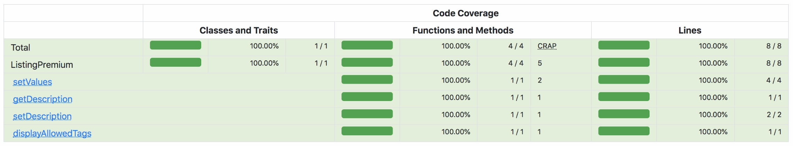
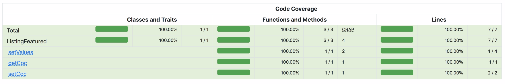

# Learn how to unit test PHP code, using PHPUnit, Xdebug & phpunit-result-printer (codedungeon)
### PHP Team Treehouse TechDegree project #6

- [The goal of this project](#the-goal-of-this-project)
- [Installation instructions](#installation-instructions)
- [Tech used](#tech-used)
- [Folder & file structure](#folder--file-structure)

## The goal of this project
#### To unit test the following 3 classes with 100% code coverage: ListingBasic, ListingPremium & ListingFeatured

- Step 1. Set-up the environment with PHPUnit, Xdebug and phpunit-result-printer
- Step 2. Create unit tests which together cover 100% of the code of the 3 classes. The code within these classes were mostly provided by Treehouse.
- Step 3. Add a feature to set & get the image property of the ListingBasic class (according to test driven development); in this case the tests in ListingImageTest.php were provided by Treehouse.
- Step 4. Use the Xdebug & PHPUnit reports to verify whether the tests are successful and which lines are or aren't covered.

#### 1. Unit test results summary



#### 2. Unit test results details



#### 3. Code coverage ListingBasic class (including new image feature)



#### 4. Code coverage ListingPremium class



#### 5. Code coverage ListingFeatured class



## Installation instructions
#### After downloading this project, make sure you run the following composer command in the project folder to install the right packages on dev:
```bash
composer install
```

#### Then make sure composer autoloads all classes automatically by running this command:

```bash
composer dump-autoload -o
```

#### Install Xdebug

See for example: https://xdebug.org/docs/install

#### Enable Xdebug

On MAMP for example: https://joshbuchea.com/mac-enable-xdebug-in-mamp/

#### And you're ready to go!  

## Tech used
#### In this project the following main concepts, languages, frameworks, packages and other technologies are applied:
PHP | Unit testing | Test Driven Development | OOP | SQLite | PHPUnit | Xdebug | phpunit-result-printer (codedungeon)

## Folder & file structure
#### The most important folders & files within this project:

      .
      ├── classes      # contains the 3 classes which should be tested (and 3 other classes)
      ├── css          # contains css files (provided by Treehouse; not impacted by this project)
      ├── fonts        # contains font files (provided by Treehouse; not impacted by this project)
      ├── inc          # contains db, config, header & footer files (provided by Treehouse; not impacted by this project)
      ├── tests        # contains the test class files (delivered as part of this project)
      │   └── log      # contains the reporting files with the results of the unit tests and the code coverage
      ├── views        # contains php files used to display the listings list and form (provided by Treehouse; not impacted by this project)
      └── root         # The set up of the PHPUnit xml & composer files were part of this project. The PHP files were provided by Treehouse.
